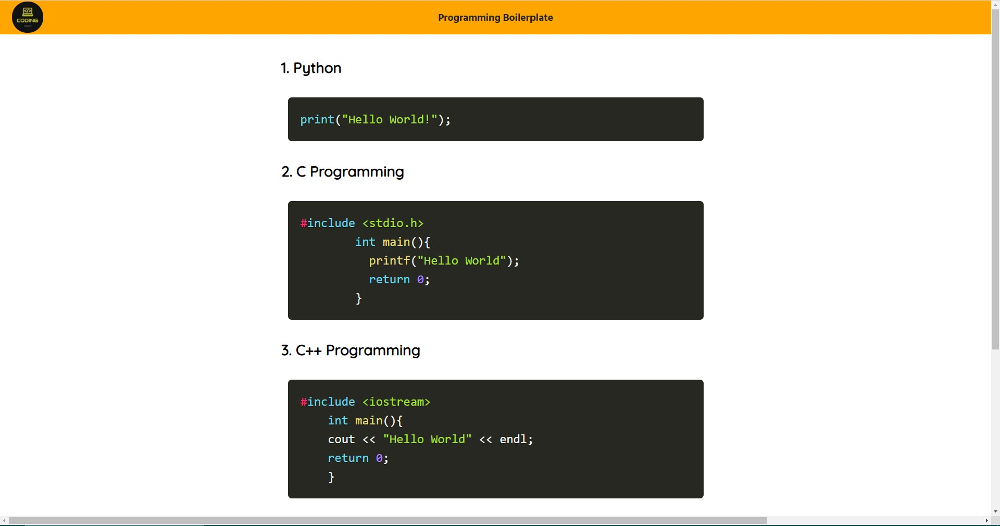

# Programming-cheatsheet
This Is My Programming Cheatsheet 
I have used the prism js and css. To make the code template. Because Making it alone is quite impossible

I have put the boilerplate of 4 programming languages which is c, c++, java, and python

Hope You like it

It looks like this 

